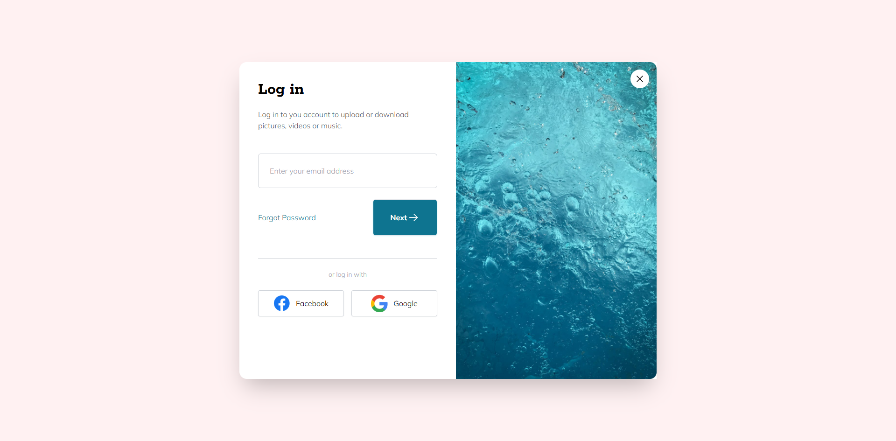

<div align="center">
  
  <h1>Anderson Toledo Martins Moreira</h1>
  <a href="http://www.atmm.dev" target="_blank">Portfolio Online</a>

> Software Developer that love learn and improve your skills in programming languages like CSS (SASS, Bootstrap, TailwindCSS) | JavaScript | React (Next.js) | Typescript | Node (Nest.js) | PHP (Laravel | WordPress), and I started learning about Python for Data Science.

</div>
<br >
<!-- References for Create budgets :: https://shields.io/category/build -->
<div align="center">
  
  <!--  -->
  
  

</div>

<br >

## Descriptions
This repository is for build 20 mini frontend projects from scratch with HTML5, CSS & JavaScript (No frameworks or libraries).

<div align="center">

### PROJECTS

Login Modal - [Demo](https://atmm.dev/courses/tailwindcss/login-modal/) - [Repository](./mini-projects/login-modal)<br><br> 
  
<br><br> 
</div>

<br />

## Programming Languages and Frameworks.
```Bash
# HTML5 / CSS3
# Javascript
```

## System Requirements
```Bash
# Git
# Node
```

## Installing and run the project

```bash
# Step 01 
# Download or clone the repository.

# Step 02 
# Open the project inside your favorite IDE (I use VSCode). You can open the entire project, or you can open a specifc folder. Choose the project that you want to see, and follow the steps below.

# Step 03 
# If you have the extension 'Live Server' installed in VSCode.

# Step 04
# Type in the terminal: 'npm i', to install dependencies.

# Step 05
# Type in the terminal: 'npm run watch', to compile the classes of TailwindCSS for each project.

```