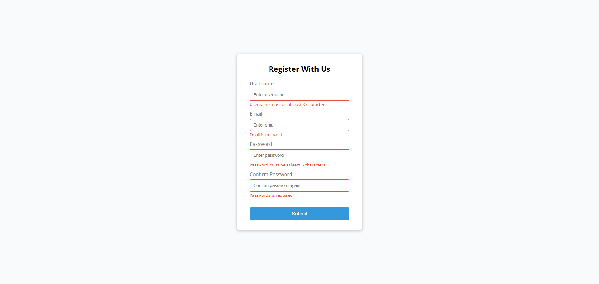

<div align="center">


# Anderson Toledo Martins Moreira

[](https://docs.google.com/document/d/1I8T4Mkb61NsTKN14ZbT1mnQKAc9LqiiPtgrYf9ayH1c/edit?usp=sharing)
[](https://docs.google.com/document/d/1vnFlRP3myxexgHk5Y6XaCKQGETPQwCygPZqGSblwCXg/edit?usp=sharing)
<br/>
[](https://www.linkedin.com/in/atmmoreira)
[](mailto:atmmoreira.rj@gmail.com?subject=From%20GitHub&cc=atmmoreira.rj@gmail&body=Hi,%20there.%20Found%20you%20from%20GitHub.)
[](https://api.whatsapp.com/send?phone=5521992890362)

</div>

<div align="center">


</div>

## Descriptions
This repository is for build 20 mini frontend projects from scratch with HTML5, CSS & JavaScript (No frameworks or libraries).

## Images and Descriptions of Screens

- Form Validator - [Demo](https://atmm.dev/courses/twenty-projects-javascript/form-validator/) - [Repository](./form-validator/)
  

## Technologies

<!--
References for Create budgets :: https://shields.io/category/build
Icons: https://simpleicons.org/
-->


### Frameworks and Libraries


### Tools


## Installing and run the project

## Running the project

```bash
# Download or clone the repository.

# Open the project, that you want to see inside your favorite:
I use Visual Studio Code

# To install dependencies of this project, type in the terminal:
`npm install`

# To run this project, type in the terminal:
`npm run start`

# In your favorite Browser, open this URL, to see the Interface.
http://localhost:5173/
```